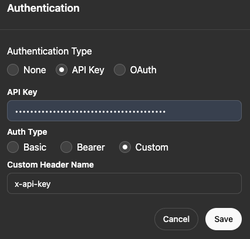
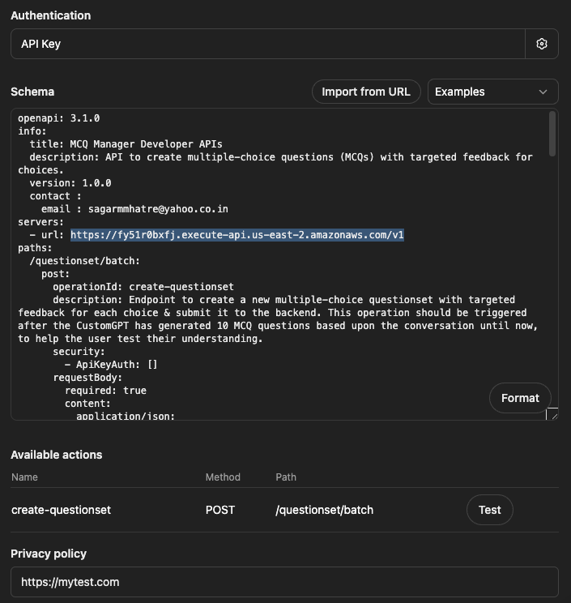

## Prerequisites

1. AWS Account ,  [AWS CLI](https://docs.aws.amazon.com/cli/latest/userguide/getting-started-install.html) 
2. Terraform 
3. Git 
4. ChatGPT Plus / Pro Subscription 

## Step 1 : Create AWS resources

Run the Terraform script to create the resources within your AWS Account.
This will create 3 DynamoDB Tables, an API Gateway (+ API Key to access it) & a user whose credentials will be used later by the Web UI.

Note : you may optionally change the region in the [infra/terraform.auto.tfvars](./infra/terraform.auto.tfvars) file 

```sh
cd infra
terraform init
terraform apply
```

### Test

Wait for a few (3-5) mins & then run the below to test if the API is operational

```sh

API_KEY=$(terraform output -raw mcq_api_key)
API_URL=$(terraform output -raw api_gw_url)

# echo $API_URL
# echo $API_KEY

curl --request POST "$API_URL/questionset/batch" \
  --header "Content-Type: application/json" \
  --header "x-api-key:$API_KEY" \
  --data '{
"questionsetid": "api-test-2503151722",
  "name": "AWS API GW Test",
  "description": "A set of questions to test knowledge on advanced features and use cases of AWS API Gateway.",
  "questions": [    
    {
      "text": "What is the primary purpose of AWS API Gateway?",
      "choices": [
        {
          "text": "To create, publish, maintain, monitor, and secure APIs at any scale.",
          "targetedResponse": "Correct! AWS API Gateway is a fully managed service that makes it easy to create and manage APIs.",
          "isCorrect": true
        },
        {
          "text": "To store and retrieve data with low latency.",
          "targetedResponse": "Incorrect. This describes Amazon DynamoDB, not API Gateway.",
          "isCorrect": false
        },
        {
          "text": "To manage serverless compute resources.",
          "targetedResponse": "Incorrect. This describes AWS Lambda, not API Gateway.",
          "isCorrect": false
        }
      ],
      "tags": [
        "api-gateway",
        "aws",
        "serverless"
      ]
    }
  ]
}'
```

Expected Output :

```json
{ "UnprocessedItems":{} }
```

## Step 2 : Set up Custom GPT 

```sh
cd infra 

API_KEY=$(terraform output -raw mcq_api_key)
echo $API_URL

API_URL=$(terraform output -raw api_gw_url)
echo $API_KEY

```

Note down the above values 

Naviagate to https://chatgpt.com/gpts/mine

Create a new (or update your ) Custom GPT  
In the instructions, add "It can also generate MCQs and submit it to the backend using the API in the Actions"

In the Configure Tab, scroll down to Actions. 
Click the Create new Action button

In the Authentication Field select 
- Authentication Type : API Key 
- Use the value from the above ($API_KEY) & insert it into API Key
- Auth Type : Custom 
- Custom Header Name : x-api-key




In the Schema , 
- copy paste the contents from the file [custom-gpt/openapi-mcq-mgr.yaml](./custom-gpt/openapi-mcq-mgr.yaml)
- Replace the URL with the value of the API URL from above 

e.g

```yaml
openapi: 3.1.0
info:
  title: MCQ Manager Developer APIs
  description: API to create multiple-choice questions (MCQs) with targeted feedback for choices.
  version: 1.0.0
  contact :
    email : sagarmmhatre@yahoo.co.in
servers:
  - url: https://6jdw8ba9u0.execute-api.us-east-2.amazonaws.com/v1

  ...

```

Privacy policy : https://mytest.com



## Step 3 : Run Web App

```sh
cd infra

AWS_ACCESS_KEY_ID=$(terraform output -raw mcq_web_ui_access_key_id)
AWS_SECRET_ACCESS_KEY=$(terraform output -raw mcq_web_ui_secret_access_key)
AWS_REGION=us-east-2

# echo $AWS_ACCESS_KEY_ID
# echo $AWS_SECRET_ACCESS_KEY

cd ..

# Navigate to the application directory
cd app

docker build -t mcq-mgr:1.0 .

# docker rm mcq-mgr -f

docker run -d -p 5002:5000 --name mcq-mgr -e AWS_ACCESS_KEY_ID=$AWS_ACCESS_KEY_ID -e  AWS_SECRET_ACCESS_KEY=$AWS_SECRET_ACCESS_KEY -e AWS_REGION=$AWS_REGION mcq-mgr:1.0 

```

Navigate to http://localhost:5002/static/dashboard.html


## Usage

Ask a few questions to your custom GPT

Then, use the below prompt : 

Generate 5 scenario-based MCQ questions & submit them to the backend.

In the Web UI , click Submit. To start the Test, click the name of the Test


## AWS resources cleanup 

Note : Proceed with caution , will permanantly delete your data

```sh
cd infra
terraform destroy
```